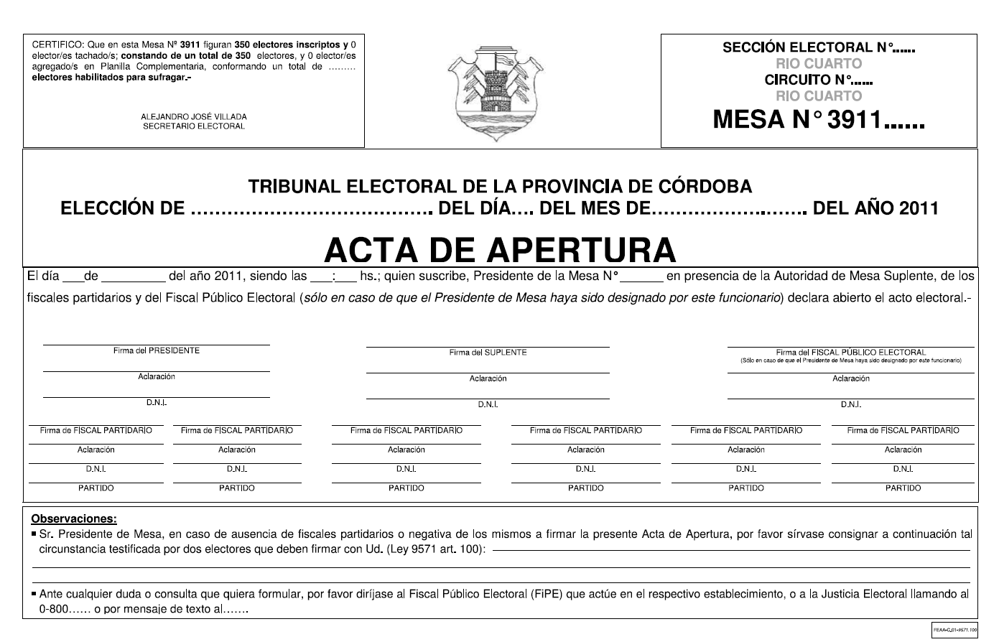
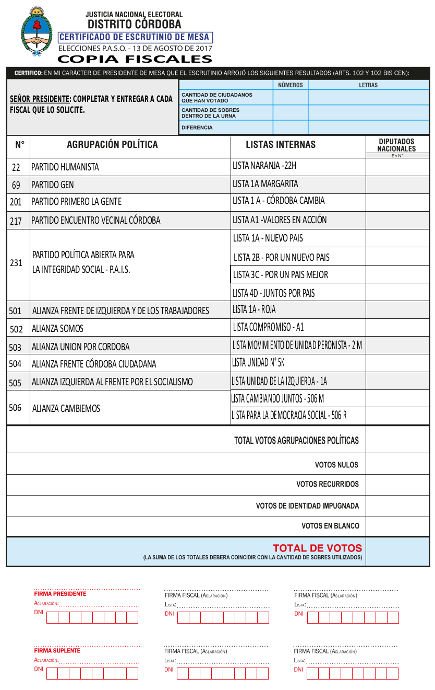
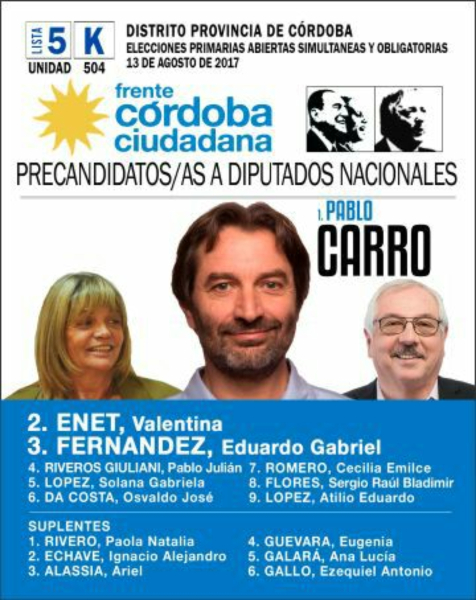

title: Capacitacion Fiscales Córdoba

background-image: url(img/cfk-carro-s.png)

# Frente Córdoba Ciudadana

## Elecciones 2017

---

class: impact

## Capacitación para autoridades de mesas de votación

### elecciones 2017

.center[]
---
layout: true

# Autoridades de los Comicios

---

--
## Presidente de Mesa y su Suplente.
--

## Fiscal público electoral

---

## Funcionarios Públicos Electorales

Son Funcionarios Públicos Electorales los Fiscales Públicos Electorales y las Autoridades de Mesas de Votación (Presidente y su Suplente)

--

- Son designados por la Justicia Electoral Provincial para dirigir y conducir el acto eleccionario.

- Revisten la calidad de funcionarios ya que actúan en nombre y representación del Estado.

???
Los Funcionarios Públicos Electorales son designados por la Justicia Electoral Provincial para dirigir y conducir el acto eleccionario. Revisten la calidad de funcionarios ya que actúan en nombre y representación del Estado.

---

## Presidente de mesa **titular**

Es el ciudadano que investido como Funcionario Público Electoral previa designación de la Justicia Electoral, ejerce la presidencia de mesa garantizando el normal desarrollo de los comicios y velando por su transparencia.

--

Actúa con entera independencia de toda otra autoridad y no obedece orden alguna que le impida el ejercicio de sus funciones en la mesa a su cargo (art. 67).

---

## Presidente de mesa **suplente**

Es obligatoria su presencia en la mesa.

--

Colabora con el Presidente de mesa titular en todas las tareas encomendadas, y lo reemplaza en caso de ausencia temporal o permanente, situación que deberá ser asentada en el acta respectiva. (art. 75).

---

layout:false
class: impact

# importante

El Presidente es la única y máxima autoridad de la mesa de votación.

--

Debe velar por el correcto y normal desarrollo de los comicios.

--

Ejerce sus funciones con absoluta independencia, no obedeciendo orden alguna que entorpezca el ejercicio de las mismas y tiene la última palabra frente a cualquier controversia que pudiera surgir en la mesa a su cargo.

--

Dispone de las fuerzas de seguridad en todo lo atinente a la mesa de votación a su cargo (art. 64, párrafo 2°).

---

# Etapas del acto electoral:

1. Recepción de la Urna e Instalación de la Mesa
2. Emisión de los Sufragios
3. Escrutinio de la Mesa y Cierre de la Urna

---
class:impact

# de 7.30 a 8.00 hs.
## Recepción de la Urna e Instalación de la Mesa

---
layout:true

### **de 7.30 a 8.00 hs.**
# Recepción de la Urna e Instalación de la Mesa

---
class: full

.center[.fit-image[]]

---

El **Presidente** recibe la urna que le entrega el Fiscal Público Electoral y firma el respectivo recibo.

--

Extrae de la urna **todos los elementos** que contenga y la cierra, poniéndole la faja de seguridad de manera tal que **no impida la introducción del Sobre de Sufragio** en la misma.

--

Instala la mesa en un lugar **visible y de fácil acceso**, y sobre ella deposita la urna.

--

Individualiza el **número de la mesa** con el cartel enviado al efecto.

---

Deposita en forma contigua a la urna y en la misma mesa, las Sobres de Sufragio.

--

Habilita un **recinto** inmediato a la mesa o bien un **espacio delimitado** por un biombo o cabina de votación, de fácil y único acceso, debiéndose **cerrar y sellar** las demás aberturas que tuviere.

--

Coloca en lugar visible a la entrada de la mesa uno de los ejemplares del **padrón de electores**.

--

Sitúa en lugar visible el afiche con la publicación de las **listas de candidatos**.

---

Verifica la **identidad** y los **poderes** de los fiscales partidarios que se hayan presentado.

--

Aquéllos que **no se encuentran presentes** al momento de la apertura del acto electoral son reconocidos al incorporarse, pero los actos que se hayan cumplido sin su presencia no son reeditados ni reproducidos.

--

El poder es otorgado por las **autoridades partidarias** y contiene: nombre y apellido, número de DNI, nombre del partido, firma del fiscal y de la autoridad partidaria que lo otorga.

---
layout:false
class:impact

# de 8.00 a 18.00 hs.
## Emisión de los Sufragios

---
layout:true

### **de 8.00 a 18.00 hs.**
# Emisión de los Sufragios

---

Suscripta por los fiscales partidarios.

--

Si no hay fiscales o los que están se niegan a firmar, el Presidente consigna en el acta tal circunstancia testificada por dos electores presentes que firman juntamente con él (arts. 75 inc. 2 y 100).

---

## Acta de apertura

El presidente de mesa, el suplente y los fiscales partidarios acreditados ante la mesa y que están inscriptos en la misma son los primeros en emitir el voto.

--

En caso de no estar inscriptos en el Padrón de la Mesa (Presidente y Suplente, Fiscal Público y Fiscales Partidarios), pueden agregarse indicando su nombre, apellido, DNI, mesa en la que votan y huella dactilar del dedo pulgar derecho,  siempre que estén empadronados en el CIRCUITO.

--

En ningún caso se puede agregar más de un (1) fiscal por partido, alianza o confederación política en la misma mesa receptora de

---

## ¿Quienes sí pueden votar?

Todos los ciudadanos que figuren en el padrón de mesa y acrediten su identidad.

Ninguna autoridad, ni aún el fiscal público electoral, puede ordenar al Presidente de mesa que admita el voto de quien no figura en el ejemplar del padrón de la mesa.

---

## ¿Quienes no pueden votar?

Los ciudadanos que **no figuren** inscriptos en el Padrón de la Mesa.

--

Quienes figuren **tachados** con línea roja.

--

Quienes **no se presenten** con su documento cívico habilitante.

--

Quienes se presenten a votar con un **DOCUMENTO ANTERIOR** al que figura en el Padrón.

???
Por ejemplo, si figura en el padrón con un DNI “ejemplar B” (nueva denominación) y se presenta con un DNI “ejemplar A”.

---

## Derecho a interrogar al elector:

Quién ejerce la **presidencia** de la mesa, por iniciativa propia o a **pedido de los fiscales**, tiene derecho a interrogar al elector sobre las diversas referencias y anotaciones del documento de identidad.

---

## Orden de votación:

Los electores votan en el orden de su llegada a la mesa correspondiente, a cuyo efecto deben formar fila de a uno. La mesa dará preferencia a:

- Mujeres embarazadas;
- Minusválidos y enfermos;
- Electores mayores de setenta (70) años, y
- Electores que deben trabajar durante la jornada electoral y acrediten dicho extremo con certificado emitido por la patronal.

---

## Comprobada la identidad del elector, se deberán seguir los siguientes pasos:

- La **autoridad** entrega el sobre firmado.
- Se retiene el DNI.
- El elector deposita el sobre.
- El Presidente registra **VOTÓ**.
- Se entrega el certificado.

???

La autoridad de mesa entrega al elector el sobre firmado en el acto. Los fiscales pueden firmar el sobre en la misma cara en que lo hizo el presidente de mesa. NO es conveniente firmar sobres en blanco por adelantado.

Se le retiene el Documento de Identidad al Elector mientras está en el cuarto oscuro votando.

El Elector deposita el sobre en la urna, dejando ver a las autoridades que es el mismo que se le entregó.

Presidente de Mesa registra en el Padrón con la palabra **VOTÓ** al lado de los datos del elector. (El fiscal lo hace en su propio padrón)

Se le entrega el **Certificado** de Emisión del Voto que completa la autoridad de mesa, al Elector.
Procedimiento para la votación

---

Seguidamente el **elector** deberá asentar su firma en el padrón.

--

Asimismo, el **presidente** asienta su firma en la constancia de emisión de voto en el espacio previsto para ello (troquel).

> Recuerde que la omisión de esta constancia ocasionará inconvenientes al votante.

--

Separe y entréguele al elector la constancia de emisión de voto debidamente firmada (troquel), reintegrándole su documento cívico en el mismo acto.

---

## Electores no videntes:

Será habilitado en el espacio de más **fácil acceso** y más cercano al **ingreso** del establecimiento

--

Allí estará disponible el **dispositivo** para el voto de personas con disminución en su capacidad visual que consta de un **portaboletas** plástico con compartimientos que contienen las boletas correspondientes a las diferentes listas de precandidatos.

--

La autoridad de mesa solictará al suplente y/o las fuerzas de seguridad el resguardo de la documentación de la mesa a su cargo, y se trasladará al COA con la urna, el sobre, el sello y el padrón correspondiente.

---

## Electores con movilidad reducida

Deberán ser acompañados por el presidente de la mesa quien colaborará con el ciudadano, en la medida que la discapacidad lo requiera.

--

Si la Mesa esta ubicada en una planta de **difícil acceso**, el presidente de mesa con la compañía de aquellos fiscales que lo deseen, deberá **trasladar la urna** a la planta baja para que el elector pueda emitir su voto en un cuarto oscuro o cabina de votación de la mesa más próxima y accesible a la entrada del establecimiento, en un lugar que asegure el secreto al voto.

--

> Bajo ninguna circunstancia se podrá sacar la urna fuera del establecimiento de votación.

---

## Impugnación del voto:

El presidente de mesa o los fiscales tienen derecho a impugnar el voto del compareciente cuando a su juicio haya falseado su identidad (es decir, que existen razones para creer que no es el titular del documento que exhibe).

--

En esta alternativa se debe exponer concretamente el motivo de la impugnación, labrándose un acta firmada por el presidente de mesa y el o los impugnantes y tomándose nota sumaria en la columna de observaciones del padrón.

---

layout: false
class: impact

# desde las 18.00 hs.
## Escrutinio de la Mesa y Cierre de la Urna  

---

layout: true

### **desde las 18.00 hs.**
# Escrutinio de la Mesa y Cierre de la Urna  

---

Después de que haya votado el último elector, el Presidente de mesa tachará en el padrón los ciudadanos que no hayan concurrido a votar y asentará el número de electores que sí votaron al pie del padrón y en el lugar previsto en el acta de escrutinio.

--

Deberá estampar el sello **sobrantes** a las Sobres no utilizadas.

---
## Responsable del escrutinio

Luego de cerrar el acto electoral el Presidente de mesa y su Suplente deberán efectuar, en el cuarto oscuro, el escrutinio de la Mesa, que consiste en clasificar y contar los votos emitidos durante la jornada.

--

El Presidente de Mesa es responsable de realizar las tareas del escrutinio y será auxiliado únicamente por el Suplente, bajo la custodia de las fuerzas de seguridad en el acceso al establecimiento.

--

Los Fiscales de Mesa, sólo observan el acto pero no deben realizar ninguna tarea del escrutinio.

---

class: full
.center[.fit-image[]]

---

## Procedimiento:

Las autoridades de mesas deberán seguir los siguientes pasos:

- Abrir la urna, extraer y contar todas las Boletas.
- Constatar que el número de Boletas extraídas de la urna coincida con el número de sufragantes.
- Verificar que las Boletas estén correctamente rubricadas con su firma.

---
## Procedimiento:

Las autoridades de mesas deberán seguir los siguientes pasos:

- Separar los sobres-formularios de votos impugnados (NO abrirlos).
- Desdoblar cada Boleta y leer en voz alta el voto. Los fiscales pueden examinar la Boleta.
- Utilizar herramienta de conteo que considere más práctica. Ej.: el pizarrón.
- Sellar cada Boleta con una leyenda que dirá “escrutada”.

---

## Clasificación de los votos:

Cada boleta se puede clasificar en las siguientes categorías:

--
- **Voto Válido**: Es el emitido mediante Boleta oficializada, y la voluntad del elector se expresa mediante la inserción de una cruz, tilde o símbolo similar en el casillero correspondiente para cada categoría de candidato o lista completa.

---
class: full
.center[]

---

- **Voto en Blanco**: Es aquel emitido mediante Boleta oficializada en la que todos o algunos de los casilleros destinados a la inserción de cruz, tilde o símbolo similar, se encuentra sin marcar.

---
## Clasificación de los votos:

- **Voto Nulo**:
 - Emitido mediante Boleta no oficializada o con papel de cualquier color o con inscripciones o imágenes de cualquier naturaleza.
 - Emitido mediante Boleta oficializadas pero que contengan inscripciones o leyendas de cualquier tipo.
 - Emitido mediante Boleta oficializada pero que contengan dos o más marcas de distintos partidos políticos para la misma categoría de candidatos o lista completa.

---
## Clasificación de los votos:

- **Voto Recurrido**: Cuando un Fiscal cuestiona la validez o nulidad del voto:
 - El pedido del fiscal se asienta en el sobre-formulario, junto a sus datos personales, domicilio y partido al que pertenece.
 - El fiscal cuestionante debe firmar dicho formulario y luego se adjunta a la Boleta.

> Los “Votos Recurridos” serán escrutados oportunamente por el Juzgado Electoral.

---
## Clasificación de los votos:

- **Votos Impugnados**: Son aquellos en que se ataca la identidad del elector:
 - El presidente de mesa o los fiscales tienen derecho a impugnar el voto cuando a su juicio el compareciente haya falseado su identidad.
 - El voto se impugna durante la etapa de emisión de los sufragios (8 a 18 hs.), por lo tanto al momento del escrutinio de la mesa, únicamente los tiene que separar y no abrir.
 - El escrutinio de los votos impugnados queda reservado al Juzgado Electoral.
a partir de las 18.00 hs.

---

## Documentos a confeccionar:
Luego de clasificar y sumar las boletas, el Presidente de mesa debe llenar la siguiente documentación:

- Acta de clausura y escrutinio
- Certificado de escrutinio dentro de la urna
- Certificados de escrutinio para los fiscales partidarios que los soliciten
- Copia del acta de escrutinio para el fiscal público Electoral.

---

## Dentro de la urna:

Luego de completar la documentación, el Presidente de mesa deberá colocar dentro de la urna la siguiente documentación:
- Las Boletas utilizadas por los electores, ya escrutadas y selladas.
- El Certificado de escrutinio con la leyenda “dentro de la urna”.
- En el sobre especial las Boletas no utilizadas, con el sello “sobrantes”.
- Los útiles electorales.

---

## Fuera de la urna:

luego de completar la documentación, el Presidente de mesa deberá colocar en el sobre especial y dejar fuera de la urna la siguiente documentación:
- El padrón electoral utilizado por el Presidente de mesa.
- El “acta de apertura”; el “acta de clausura y escrutinio” debidamente firmadas.
- Los votos recurridos e impugnados.

---

## Entrega de la documentación:

El Presidente de mesa debe entregar personalmente al Fiscal Público Electoral los siguientes elementos, en este orden:
- La urna cerrada
- El sobre especial
- Copia del acta de escrutinio para el Fiscal Público Electoral.

---

## Recibo y custodia de la documentación:

El Fiscal Público Electoral extenderá el recibo correspondiente, con indicación de la hora y les ordenará a los efectivos policiales que presten la custodia necesaria hasta que la urna y el sobre pertinente se trasladen al lugar indicado por el Juzgado Electoral.
a partir de las 18.00 hs.

---
layout: false
class: impact

### Ud. ha finalizado con su tarea, y de esta manera ha cumplido con uno de los roles más importantes que demanda nuestra democracia para funcionar adecuadamente.

---
class:impact

# Muchas Gracias

.center[]

fiscalizacionpablocarro@gmail.com
